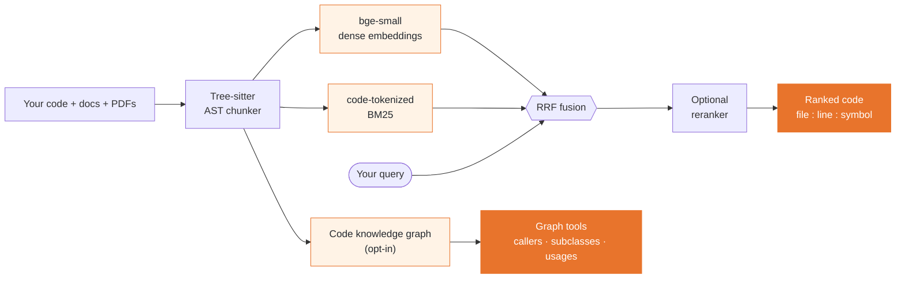

# Lynx

**LynxMCP is a 100% local MCP server for the code questions grep can't answer: what calls this, what breaks if I change it, where is the code that does X, how does the library version I actually use behave. AST-aware chunking, hybrid BM25 + dense retrieval, an optional code knowledge graph, and your library docs and PDFs indexed next to your code. Works with any MCP client (Claude Code, Cursor, Windsurf, Antigravity, ...).**

[](https://github.com/lorenzo-cambiaghi/LynxMCP/actions/workflows/test.yml)
[](LICENSE)

[](https://glama.ai/mcp/servers/lorenzo-cambiaghi/LynxMCP)

[](https://glama.ai/mcp/servers/lorenzo-cambiaghi/LynxMCP)

Grep is the right tool when you know the identifier, and your agent already has it. Lynx is for the questions grep cannot answer. Behaviour: "where do we clamp the camera zoom?" matches nothing literal. Structure: who calls this, what inherits from it, what breaks if it changes; polymorphic dispatch leaves no textual trace. Knowledge past the model's training cutoff: the docs of the framework version you run, indexed as a source. Nothing leaves your machine.

## What grep can't answer

Each row is measured; the numbers come from the [benchmarks](#benchmarks-reproducible) below.

| Question | Agentic grep | Lynx |
|---|---|---|
| "What inherits from `Field`?" (Django, 100 classes over 4 levels) | 101 grep rounds, one per discovered class | 4 `graph_query` calls, `file:line` on every edge |
| "What breaks if I change `ApplyDamage`?" | the textual mentions of the name | `impact`: every transitive caller with its hop distance, plus the tests to re-run |
| "Where do we validate session tokens?" on C# (Json.NET) | hit@1 33% | hit@1 47% |
| "How does this API behave in the version we ship?" | the model's memory | the docs you indexed, cited with the page they came from |

Where grep is better, this page says so. On Guava, whose class names document themselves (`BloomFilter`, `RateLimiter`), grep ranks higher: hit@1 73% against 60%. On a repository that fits in the agent's context, the built-in tools are fine. Lynx pays off on large codebases, on framework docs your model has gone stale on, and on repeated sessions where re-exploring from scratch is waste.

## Quickstart

```bash
# 1. Install the CLI (isolated, no venv ritual). About 460 MB on disk, no PyTorch.
pipx install lynx-mcp
#    or: uv tool install lynx-mcp

# 2. Create a config and point it at your project
lynx manager init
lynx source add myproject --type codebase --path /path/to/your/repo

# 3. Build the index (downloads the 130 MB embedding model on first run)
lynx build
```

`lynx manager init` also offers to open the web UI, where the same source can be added through a guided form with a folder picker. Everything below works either way.

Every tool your AI gets is also a command, with the same name and the same output: `lynx find-definition ApplyDamage`, `lynx impact ApplyDamage`, `lynx graph query --op callers --symbol ApplyDamage`. Add `--json` to any of them for scripts.

Then register Lynx in your MCP client. Claude Code is shown; the [full guide](docs/GUIDE.md) covers Cursor, Antigravity, and generic stdio clients, or let `lynx manager ui` generate the snippet for you:

```json
{
  "mcpServers": {
    "lynx": {
      "command": "lynx",
      "args": ["serve", "--config", "/absolute/path/to/config.json"]
    }
  }
}
```

The server answers the MCP handshake in about a second and opens the indexes in the background; a call that arrives earlier gets the loading state back and is retried. If you would rather skip the terminal, there are [double-click installers](https://github.com/lorenzo-cambiaghi/LynxMCP/releases) for macOS and Windows.

## The tools your AI gets

The tool set is fixed: it does not grow with the number of sources. It is also layered, because every tool definition rides in your client's context on every turn. Three profiles: `core` (5 tools, about 1,200 tokens of definitions), `standard` (10 tools, about 2,700 tokens, the default) and `full` (17 tools, about 3,800 tokens). Set `tools.profile` in config.json or pass `lynx serve --profile full`; `tools.include` adds a single tool to a profile. Tools take a `source` argument where relevant.

| Tool | Profile | What it answers |
|------|---------|-----------------|
| `search(query, source?, outline?)` | core | Primary hybrid search. Omit `source` to search every source at once (RRF-fused). `outline=true` returns signatures only, for cheap triage. |
| `deep_search(queries, source?)` | standard | Escalation: tries multiple query phrasings until one passes a quality threshold. |
| `graph_query(operation, symbol?)` | standard | `callers`, `callees`, `subclasses`, `superclasses`, `imports`, `neighbors`, `shortest_path`, `overview`, `surprising_connections`, `status`. |
| `find_definition(symbol)` | standard | Where is X defined? (AST-precise when the graph is on, BM25 fallback otherwise.) |
| `find_usages(symbol)` | core | Every use of X: calls *and* non-call references (generics, decorators, docs). |
| `find_tests_for(symbol)` | full | Are there tests for X? |
| `find_similar(snippet)` | full | Does code like this already exist? |
| `describe_symbol(symbol)` | core | One-shot context for X: definition, who calls it, what it calls, its tests, in a single call. |
| `impact(symbol)` | core | Blast radius: everything that reaches X *transitively* through the call graph (with hop distance), plus the tests to re-run. |
| `module_summary(file)` | full | A file as a unit: the symbols it defines, what it imports, and which files depend on it. *(graph)* |
| `repo_overview()` | standard | "What is this and where do I start": detected languages, frameworks, entry points, and build/test/run commands. |
| `export_graph(target, mode?)` | full | Render a shareable, offline graph view (a symbol's blast radius or a file hub) as a single self-contained file. *(graph)* |
| `search_diff(query, base?)` | standard | Search only the files changed vs a base branch. Built for code review. |
| `feedback(trying_to_do, tried, stuck)` | core | The agent files a report when the index couldn't answer. Stored 100% locally, your signal for tuning sources. |
| `list_sources` / `get_rag_status` / `update_source_index` | full | Introspection and maintenance. |

Retrieval tools carry MCP `readOnlyHint` annotations, so clients can auto-approve them. The only write is `export_graph`, which saves a graph view file. The server ships its usage playbook in the MCP handshake (`instructions` plus a `lynx://guide` resource), so your agent knows how to query well without any rules-file setup.

*(graph)* tools need the optional code knowledge graph enabled for the source. The tool set is per-capability, never per-source.

<p align="center">
  
  <br>
  <sub><b>Shareable graph views</b>: <code>lynx graph export --symbol GetVoxel</code> writes one self-contained, offline file (no server, no CDN) with the symbol's <b>blast radius</b>, who calls it (above) and what it calls (below). Attach it to a PR or archive it for an audit.</sub>
</p>

## How it works



- Tree-sitter parses 18+ languages (19 grammars, counting TSX) and indexes whole functions and classes, not arbitrary text windows.
- Retrieval is hybrid: dense embeddings plus code-tokenized BM25, fused with RRF, with an optional cross-encoder reranker.
- The code knowledge graph (opt-in) records who calls what, inheritance and imports, and answers "what breaks if I change this?" with the actual blast radius.
- Sources can be codebases, public docs sites (fetched once, on demand; JS-rendered SPAs via optional headless Chromium) and PDFs, searched side by side.
- A file watcher re-indexes a saved file in about 2 seconds. No manual rebuild ritual.
- Search and the graph are also served as rows over a local HTTP API, so SQL engines can join your code with tickets, PRs or logs (see [Integrations](#integrations)).
- `lynx manager ui` gives you guided setup, a query playground, diagnostics and client config snippets in the browser.

Everything runs locally: HuggingFace models are downloaded once, then Lynx switches to offline mode. No telemetry, no cloud index, no code upload. The only network access is the model download and the *explicit* `webdoc` fetch step you trigger yourself.

The models run on ONNX Runtime, so there is no PyTorch in the install: about 460 MB on disk, and a 165 MB download on Linux where the torch wheel alone used to bring 4 GB of CUDA libraries. Same model, same vectors, so an index built by an earlier version keeps working.

Open as many sessions on one index as you like: two editor windows, an editor plus the web UI, a CLI query while the server runs. They all search the same index. Only indexing is exclusive, and the process doing it hands over automatically if you close it.

Behind a firewall or on an air-gapped machine? The model can come from a mirror, from this repo's GitHub Releases (the automatic fallback), or from an archive you carry over; see [Restricted networks](docs/GUIDE.md#restricted-networks-and-air-gapped-machines) in the guide.

<p align="center">
  <a href="docs/GUIDE.md#lynxmanager--guided-setup-web-ui-diagnostics-new-in-v09">
    
  </a>
  <br>
  <sub><b><a href="docs/GUIDE.md#lynxmanager--guided-setup-web-ui-diagnostics-new-in-v09">LynxManager</a></b>: guided setup, query playground &amp; diagnostics, all in the browser. <a href="docs/GUIDE.md#lynxmanager--guided-setup-web-ui-diagnostics-new-in-v09">Full walkthrough</a></sub>
</p>

## Benchmarks (reproducible)


Three codebases, three languages, behavioural questions with known ground-truth files, and a grep baseline built to be strong (IDF-weighted multi-keyword ranking with ideal stopword removal, closer to BM25 than to an agent's first `rg`). Methodology and per-task results: [Django](benchmarks/RESULTS.md), [Json.NET](benchmarks/RESULTS_csharp.md), [Guava](benchmarks/RESULTS_java.md).

| grep / Lynx | Django 5.2 (Python) | Json.NET (C#) | Guava (Java) |
|---|---|---|---|
| corpus | 883 files, 158k lines, 20 questions | 240 files, 69k lines, 15 questions | 606 files, 181k lines, 15 questions |
| hit@5 | **95%** / 85% | 67% / **73%** | **93%** / 80% |
| hit@1 | 45% / **55%** | 33% / **47%** | **73%** / 60% |
| MRR | 0.64 / **0.67** | 0.47 / **0.58** | **0.81** / 0.70 |
| median tokens to answer | 4,150 / **1,725** | 6,590 / **1,540** | 5,892 / **807** |
| tool round-trips before the code is in context | 2+ / **1** | 2+ / **1** | 2+ / **1** |

Ranking swings with how self-documenting the code is: Lynx ahead on C#, where PascalCase identifiers and sparse comments starve a lexical baseline; mixed on Python, ahead at hit@1 and behind at hit@5 in Django's docstring-rich code; behind on Guava. The token cost does not swing. It drops 58% to 86% every time, because Lynx hands back the whole function with `file:line`, symbol and score in one call, where grep returns match lines and then needs a read.

The structural gap is of a different kind. "What inherits from `Field`?" over Django's 100-class hierarchy takes grep 101 rounds, one per discovered class, each a full model inference over the growing context; `graph_query` answers it in 4 calls from resolved inheritance edges, same recall, `file:line` on every edge.

```bash
# reproduce: Python (Django)
git clone --depth 1 --branch 5.2 https://github.com/django/django.git benchmarks/_target/django
python benchmarks/run_benchmark.py && python benchmarks/structural_demo.py

# reproduce: C# (Json.NET)
git clone --depth 1 https://github.com/JamesNK/Newtonsoft.Json.git benchmarks/_target/jsonnet
python benchmarks/run_benchmark.py --tasks benchmarks/tasks_jsonnet.json \
  --target-dir benchmarks/_target/jsonnet --storage-dir benchmarks/_storage_csharp \
  --results-json benchmarks/results_csharp.json --results-md benchmarks/RESULTS_csharp.md

# reproduce: Java (Guava)
git clone --depth 1 https://github.com/google/guava.git benchmarks/_target/guava
python benchmarks/run_benchmark.py --tasks benchmarks/tasks_guava.json \
  --target-dir benchmarks/_target/guava --storage-dir benchmarks/_storage_java \
  --results-json benchmarks/results_java.json --results-md benchmarks/RESULTS_java.md
```

## What it costs, in tokens and in money

Per retrieval, the saving is the measured delta above: 2,400 to 5,100 fewer tokens to get the answer into context. Per session, the tool definitions cost 1,200 tokens (`core`), 2,700 (`standard`) or 3,800 (`full`), so a session has paid for its tool list after the first or second retrieval. `outline` triage cuts the search step by another 2.4x on broad queries ([measured](docs/OUTLINE.md)).

In money, for 25 engineers making 60 retrievals a day (31,500 a month), the yearly API bill Lynx removes, as a range across the three codebases:

| Flagship model (input $/1M) | Measured floor | With the saved round trip |
|---|---:|---:|
| Claude Fable 5 ($10) | $9,200 to $19,200 | $16,700 to $26,800 |
| GPT-5.5, Claude Opus 4.8 ($5) | $4,600 to $9,600 | $8,400 to $13,400 |

The floor counts only the smaller tool output, no assumptions. The second column adds the one grep round trip Lynx removes, whose 20k-token context is re-read from the prompt cache at a tenth of the input price; that discount is the single modelled assumption, and it is a knob. Run it for your own team, prices and codebase: `python benchmarks/savings_calculator.py --devs N`, or the interactive [savings calculator](benchmarks/savings_calculator.html) (presets in [`pricing.json`](benchmarks/pricing.json) and [`measured.json`](benchmarks/measured.json), yours to edit).


## Read less: outline mode

Every search ranks the same way. `search(query, outline=true)` (or `?view=outline` over HTTP) returns the same ranked hits without their bodies: a one-line signature plus the first line of the docstring, so the agent scans the candidates and reads the single body it needs, by its cited `file:line`. On a public repo (`psf/requests`) it cut the search step to 2.4x fewer tokens. When to use which, the measured data and the chart: [docs/OUTLINE.md](docs/OUTLINE.md).

## Integrations

Search and the code graph are served as NDJSON over a local HTTP API (`/api/v1`), and the MCP tools compose with any other MCP server your agent has. Everything below stays on your machine; only the other side of a join (GitHub, Jira, Sentry) touches an API.

- [Coral](docs/CORAL.md): Lynx is a community source in Coral's registry, `lynx.search` plus six graph functions, so a behavioural question becomes a SQL table you join with live GitHub or Sentry data.
- [DuckDB](docs/DUCKDB.md): `read_ndjson_auto('http://127.0.0.1:8765/api/v1/search?...')` is a table, no plugin and no daemon; join code relevance with git churn, error logs or ticket exports.
- [Steampipe](integrations/steampipe/steampipe-plugin-lynx/): a plugin with `lynx_source`, `lynx_search` and `lynx_graph` tables that join per row, one search per row of another table; prebuilt macOS and Linux binaries on the [releases page](https://github.com/lorenzo-cambiaghi/LynxMCP/releases?q=steampipe).
- [GitHub Action](integrations/github-action/): on every PR, a comment with the downstream callers and the semantically related code, indexed locally on the runner.
- [MCP recipes](docs/MCP_RECIPES.md): agent patterns combining Lynx with GitHub, Sentry and Jira MCP servers (triage, PR impact, ticket to code).

## Documentation

| | |
|---|---|
| [Full guide](docs/GUIDE.md) | Configuration, all source types (codebase / webdoc / PDF), retrieval internals, tool profiles, troubleshooting |
| [Manager UI](docs/GUIDE.md#lynxmanager--guided-setup-web-ui-diagnostics-new-in-v09) | Guided setup, playground, diagnostics |
| [Outline mode](docs/OUTLINE.md) | Signatures instead of bodies: when to use it, measured data, chart |
| [Coral](docs/CORAL.md) / [DuckDB](docs/DUCKDB.md) / [Steampipe](integrations/steampipe/steampipe-plugin-lynx/) | Code search and the code graph as SQL tables |
| [MCP recipes](docs/MCP_RECIPES.md) | Combining Lynx with GitHub / Sentry / Jira MCP servers |
| [PR impact analysis (GitHub Action)](integrations/github-action/) | Downstream callers and related code, commented on every PR |
| [config.example.json](config.example.json) | Annotated example configuration |

## Status

Developed by one author; APIs may still move before 1.x stabilizes. Issues and PRs are welcome. The test suite runs with `pytest` and CI must stay green. See [ROADMAP.md](ROADMAP.md) for what's under consideration (and what is explicitly *not* planned).

## License

[Apache 2.0](LICENSE)

---

<!-- MCP Registry ownership marker — must stay in the README published on
     PyPI so registry.modelcontextprotocol.io can verify the package.
mcp-name: io.github.lorenzo-cambiaghi/lynx
-->
